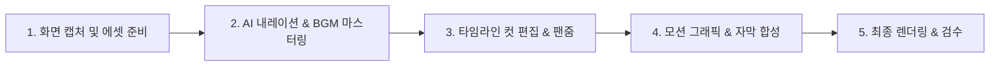

# [PRD] TV Europe Sales Management Portal 1분 소개 영상 기획서 (Product Requirements Document)

---

## 1. 프로젝트 개요 (Executive Summary)

| 항목 | 내용 |
| :--- | :--- |
| **프로젝트명** | TV Europe Sales Management Portal 1분 핵심 소개 영상 제작 |
| **목적** | 유럽 TV 영업/손익/제품/가격/시장 데이터를 단일 플랫폼으로 통합한 'TV Europe Sales Management Portal'의 구축 목적, 카테고리별 에이전트 구조, 핵심 에이전트(`Price Tracker`, `KPI Sheet`)의 실무 가치 및 향후 AX 고도화 비전을 60초 내에 직관적으로 전달 |
| **타깃 오디언스** | LGE 유럽 영업 본사/법인 실무진, PM, 법인장 및 유관 부서 (SCM, 상품기획, 마케팅) |
| **러닝타임** | **60초 (1분)** |
| **영상 규격** | 16:9 Widescreen (1920x1080 Full HD / 60fps), MP4 (H.264) |
| **사운드 & 언어** | 한국어 AI 내레이션 (전문적이고 신뢰감 있는 톤) + 한/영 병기 자막 (Dual Subtitle) + 모던 테크 BGM (경쾌하고 스마트한 슬레이트 앰비언트) |
| **비주얼 톤앤매너** | Stitch Strategic Insight System UI 기반 (Slate `#0F172A`, Teal `#0D9488`, Blue `#3B82F6`), 실제 포털 UI 녹화 + 줌인(Pan/Zoom) + 하이라이트 모션 그래픽 |

---

## 2. 영상 구성 구조 (Time Breakdown & Narrative Arc)

```mermaid
gantt
    title TV Europe Sales Management Portal 1분 영상 타임라인 (60s)
    dateFormat  X
    axisFormat %s초
    section Scene 1
    포털 구축 목적 및 단일 뷰 가치       :0, 10
    section Scene 2
    4대 카테고리 & 15개 에이전트 허브     :10, 25
    section Scene 3
    대표 에이전트 심층 시연 (KPI Sheet & Price Tracker) :25, 45
    section Scene 4
    향후 AX 고도화 비전 & 클로징        :45, 60
```

- **Scene 1 (00:00 ~ 00:10, 10초)**: **[도입 & 목적]** 데이터 파편화 극복 및 단일 의사결정 허브 탄생
- **Scene 2 (00:10 ~ 00:25, 15초)**: **[구조 & 카테고리]** 4대 핵심 영역과 15개 전문 에이전트 오버뷰
- **Scene 3 (00:25 ~ 00:45, 20초)**: **[핵심 기능 시연]** `KPI Sheet` (매출/WOS) & `Price Tracker` (12개국 가격 모니터링)
- **Scene 4 (00:45 ~ 01:00, 15초)**: **[비전 & 엔딩]** 데이터 기반 실시간 실행력, AI 어시스턴트 고도화 및 확장

---

## 3. 상세 스토리보드 및 씬별 연출 명세서 (Scene-by-Scene Script & Direction)

### Scene 1: 포털 도입 및 통합 목적 (00:00 ~ 00:10 / 10초)

* **비주얼 연출 (Screen & Visual)**:
  - 어두운 배경에서 모던한 타이틀 모션 그래픽 등장: *"TV Europe Sales Management Portal"*
  - 포털의 메인 홈 화면(좌측 네비게이션 + 15개 카드 그리드)으로 부드럽게 페이드인/줌인
  - 화면 상단 보안 및 단일 로그인(SSO) 아이콘과 통합 검색/필터 영역 강조
* **모션/이펙트 (Effects)**:
  - 흩어져 있던 엑셀 파일/보고서 아이콘들이 포털 하나의 화면으로 흡수되는 3D/2D 모션
* **음성 내레이션 (Voiceover Script - KO)**:
  > "유럽 15개 법인의 매출, 손익, 가격, 시장 데이터가 하나로 연결됩니다. 유럽 TV 영업의 실시간 의사결정 허브, **TV Europe Sales Management Portal**입니다."
* **화면 자막 (Subtitles)**:
  - **KO**: 유럽 15개 법인의 영업·손익·가격 데이터를 하나로! 실시간 통합 관리 포털
  - **EN**: One Unified Platform for Sales, P&L, Pricing & Market Intelligence Across 15 European Subsidiaries

---

### Scene 2: 4대 핵심 카테고리 & 15개 에이전트 구조 (00:10 ~ 00:25 / 15초)

* **비주얼 연출 (Screen & Visual)**:
  - 좌측 280px 사이드바 아코디언 메뉴가 순차적으로 펼쳐지며 카테고리 뱃지 하이라이트
  - 4개 영역 카드들이 화면에 순서대로 리드미컬하게 포커싱:
    1. **매출/손익 관리**: Daily Sales, KPI Sheet, P&L, GDMI, 선행수익성, Simulator (6개)
    2. **제품 정보**: TV PRM, Spec Sheet, TV Profile, 거래선 방한 캘린더 (4개)
    3. **가격 관리**: Price Tracker, ATA Guide (2개)
    4. **시장 정보**: GfK Monthly, M/S Trend, FX-Monitor (3개)
* **모션/이펙트 (Effects)**:
  - 각 카테고리별 컬러 라인(Teal, Blue, Amber, Purple) 글로우 효과 및 에이전트 카드 바운스 인
* **음성 내레이션 (Voiceover Script - KO)**:
  > "매출과 손익 관리부터 제품 사양, 가격 가이드라인, 시장 트렌드까지—4개 핵심 카테고리, 15개의 특화된 전문 에이전트가 완벽한 업무 네비게이션을 제공합니다."
* **화면 자막 (Subtitles)**:
  - **KO**: 4대 핵심 영역 · 15개 전문 에이전트 원클릭 연동 (매출/손익 · 제품 · 가격 · 시장)
  - **EN**: 4 Strategic Pillars & 15 Dedicated Agents: Seamless One-Click Navigation

---

### Scene 3: 대표 에이전트 심층 기능 시연 (00:25 ~ 00:45 / 20초)

#### [Sub-Scene 3A: KPI Sheet] (00:25 ~ 00:35 / 10초)
* **비주얼 연출 (Screen & Visual)**:
  - 포털 카드에서 `KPI Sheet` 클릭 -> 상단 '포탈로 돌아가기' 탑바와 함께 대시보드 뷰어 즉시 로드
  - 권역/법인별 매출 진척률 막대 그래프와 주차별 재고 주수(WOS) 지표 화면으로 줌인
* **모션/이펙트 (Effects)**:
  - 핵심 KPI(YoY 성장률, WOS 타깃 달성률) 수치에 펄스 링(Pulse Ring) 하이라이트
* **음성 내레이션 (Voiceover Script - KO)**:
  > "**KPI Sheet**를 통해 권역별 매출 실적과 출하 진척률, 유통 재고 주수(WOS)를 한눈에 파악하여 공급 리스크를 선제적으로 방어합니다."
* **화면 자막 (Subtitles)**:
  - **KO**: [KPI Sheet] 권역/법인별 매출 실적 및 주차별 재고(WOS) 실시간 모니터링
  - **EN**: [KPI Sheet] Real-time Tracking of Regional Sales Performance & Weeks of Stock (WOS)

#### [Sub-Scene 3B: Price Tracker] (00:35 ~ 00:45 / 10초)
* **비주얼 연출 (Screen & Visual)**:
  - 상단 탑바를 통해 복귀 후 `Price Tracker` 진입
  - 유럽 12개국 주요 유통의 실시간 온라인 최저가 비교 테이블 및 Price Gap 트렌드 차트 클로즈업
* **모션/이펙트 (Effects)**:
  - 주요 OLED 라인업의 국가별 최저가 및 유통별 변동 알림(Gap Alert) 태그 확대 모션
* **음성 내레이션 (Voiceover Script - KO)**:
  > "유럽 12개국의 실시간 유통가를 추적하는 **Price Tracker**로 경쟁사 대비 가격 갭을 정밀 분석하고 최적의 가격 전략을 수립합니다."
* **화면 자막 (Subtitles)**:
  - **KO**: [Price Tracker] 유럽 12개국 유통 최저가 추적 & 실시간 Price Gap 분석
  - **EN**: [Price Tracker] Tracking Retail Prices Across 12 Countries & Analyzing Real-time Price Gaps

---

### Scene 4: 향후 AX 고도화 비전 및 클로징 (00:45 ~ 01:00 / 15초)

* **비주얼 연출 (Screen & Visual)**:
  - 포털 화면이 PC, 태블릿, 모바일 멀티 디바이스 목업 프레임으로 전환
  - 화면 한켠에 **🤖 AI Copilot & Predictive Assistant** 인터페이스 그래픽 오버레이 (자연어 질의 & 자동 시뮬레이션 알림)
  - 엔딩 슬레이트: LG 로고 + *"Data-Driven Agility for European TV Business"* + 접속 URL 표기
* **모션/이펙트 (Effects)**:
  - 텍스트 페이드 업, 배경 파티클 애니메이션, 피날레 사운드 이펙트
* **음성 내레이션 (Voiceover Script - KO)**:
  > "이제 단순 조회를 넘어, AI 예측과 지능형 분석으로 더 스마트해집니다. 유럽 TV 영업의 데이터 혁신, TV Europe Sales Management Portal과 함께하십시오."
* **화면 자막 (Subtitles)**:
  - **KO**: 데이터 기반 실시간 의사결정의 완성 · AI 기반 예측 어시스턴트로의 진화
  - **EN**: Empowering Data-Driven Agility with AI Predictive Intelligence for Europe TV

---

## 4. 오디오 & 테크니컬 가이드라인 (Audio & Technical Spec)

| 구분 | 사양 및 리소스 지침 |
| :--- | :--- |
| **BGM (배경음악)** | 120~125 BPM 테크/기업 비즈니스 앰비언트 (세련되고 경쾌한 전자 비트, 사운드 볼륨 -18dB) |
| **TTS/Voice (음성)** | 한국어 표준 남/여 전문 성우 톤 (신뢰감, 안정감, 발음 명확도 상급, 사운드 볼륨 -3dB) |
| **Sound Effects (SFX)**| • 마우스 클릭음 (Soft Click) • 화면 전환 스위시 (Whoosh/Swoosh) • 데이터 하이라이트 딩 (Subtle Chime) • 엔딩 임팩트 글리치/라이징 톤 |
| **해상도/비트레이트** | 1920x1080 (1080p Full HD), 60fps, 12~15 Mbps 비트레이트, 컬러 스페이스 Rec.709 |
| **자막 스타일** | 프리미어/CapCut 표준: Inter/Pretendard Bold, 폰트 크기 42pt, 흰색 글자 + 반투명 다크 배경 바 (`#0F172A` opacity 85%) |

---

## 5. 제작 프로세스 및 체크리스트 (Production Roadmap)

1. **Step 1. 화면 캡처 및 에셋 수집 (Asset Sourcing)**:
   - 포털 메인 화면 고해상도 비디오 캡처 (1080p 60fps)
   - `KPI Sheet` 및 `Price Tracker` 대시보드 인터랙션 화면 캡처
   - Stitch UI 고화질 로고 및 벡터 그래픽 추출
2. **Step 2. 오디오 트랙 생성 (Voice & Audio)**:
   - 본 PRD의 4개 씬 스크립트를 기반으로 AI Voice(ElevenLabs / Clova / Vrew) 음성 생성 (정확히 56~58초 분량)
   - BGM 믹싱 및 덕킹(Ducking) 적용
3. **Step 3. 컷 편집 및 시각 이펙트 (Video Editing)**:
   - 스크립트 타이밍에 맞춘 화면 싱크 및 부드러운 Pan & Zoom (20% 스케일업) 적용
   - 씬 간 모던한 슬라이드/페이드 트랜지션
4. **Step 4. 자막 & 모션 그래픽 합성 (Graphics & Subtitles)**:
   - 한/영 2단 자막 싱크 배치
   - 포털 UI 주요 지표 강조용 펄스 링, 하이라이트 박스 모션 오버레이
5. **Step 5. 최종 검수 및 배포 (Review & Export)**:
   - 60초 러닝타임 준수 여부 및 가독성 검수 후 배포
