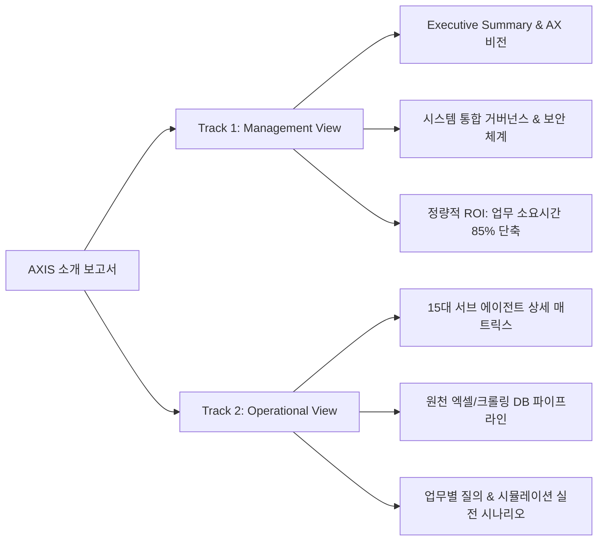

# [PRD] AXIS (Agentic eXecution & Integrated Sales System) & TV Europe Sales Management Portal 종합 소개서 구축 요구사항 정의서

---

- **프로젝트 명칭**: AXIS 시스템 및 TV Europe Sales Management Portal 종합 소개 보고서 (HTML)
- **문서 버전**: v1.0.0 (Approved Architecture)
- **작성 일자**: 2026-10-01
- **주관 부서**: TV 유럽영업담당 / AX Task Force
- **대상 독자**: 
  - **경영진 (Executive)**: 유럽영업담당, 본사/법인 경영진, 마케팅/기획 임원
  - **영업 실무진 (Operational Users)**: 본사 유럽영업 실무자, 유럽 15+ 법인/지사 영업 담당자, SCM, 상품기획, 손익 관리자
- **최종 산출물 위치**:
  - 원본 파일: `00. TV Europe Sales Management Portal/docs/AXIS_System_Architecture_Guide.html`
  - 아카이브 보관: `99. Master Agent/Task/20261001_AXIS시스템소개보고서/`

---

## 1. 프로젝트 배경 및 목적 (Background & Objectives)

### 1.1 추진 배경
1. **데이터 사일로(Silo) 및 파편화 문제**:
   - 유럽 15개 이상 해외법인의 일간 매출, 주간 KPI, 월간 P&L, 수시 시장 보고서(GfK), 온라인 유통 가격(Price Tracker), 환율(FX) 등 데이터가 개별 엑셀 파일과 분산된 시스템에 흩어져 있어 단일 의사결정을 위해 막대한 탐색 비용이 소요됨.
2. **AI 대전환(AX, AI Transformation)의 전사적 실행**:
   - 단순한 데이터 뷰어를 넘어, 15개 전문 서브 에이전트와 이들을 자율 오케스트레이션하는 **Master AI Agent**, 그리고 이를 단일 허브에서 접근할 수 있는 **TV Europe Sales Management Portal**을 결합한 통합 지능형 플랫폼 **AXIS (Agentic eXecution & Integrated Sales System)**를 구축함.
   - **AXIS 공식 정의 (추천 3안 확정)**:
     > *"AXIS는 업무별 에이전트와 세일즈 포탈을 통합 관리하는 마스터 에이전트입니다. 전사 영업 데이터를 기반으로 복잡한 분석을 해결하며 최적의 해외영업 전략 및 의사결정을 뒷받침합니다."* (공백 포함 98자)
   - **A (Agentic)** : 자율적 데이터 수집·시뮬레이션을 수행하는 15개 전문 AI 에이전트
   - **X (eXecution)** : 실시간 의사결정 및 영업 실행을 직접 수행
   - **I (Integrated)** : 유럽 15+ 법인 영업 데이터의 단일 패브릭 통합
   - **S (Sales System)** : 현장 영업과 경영진 모두를 위한 올인원 해외영업 시스템
3. **사용자 온보딩 및 경영진 보고의 일원화 필요**:
   - 일반 영업 사원에게는 "일상 업무에서 어떻게 쉽게 활용할 수 있는지", 경영진에게는 "시스템의 아키텍처, 거버넌스, 보안성 및 정량적 도입 효과(ROI)"를 입체적으로 설명하는 공신력 있는 소개 문서가 필요함.

### 1.2 구축 목적
- 본 프로젝트는 Stitch Strategic Insight System 및 `2027 유럽 TV 사업계획 보고서`의 입증된 고품격 웹 레이아웃을 계승하여, 경영진과 실무자 모두를 만족시키는 **8대 챕터 정밀 분할형 하이브리드(2-Track) 인터랙티브 HTML 소개 보고서**를 제작하고 세일즈 포탈에 공식 연동하는 것을 목표로 합니다.

---

## 2. 타깃 오디언스 및 2-Track 전달 전략 (Target Personas)



1. **경영진 (Track 1 - Strategic & Executive Focus)**:
   - 비즈니스 가치, 데이터 보안 및 권한 격리, 전사 AI 자율 참모 시스템의 청사진, 정량적 투자 대비 효과(ROI).
2. **실무진 (Track 2 - Tactical & Operational Focus)**:
   - 각 에이전트의 구체적 기능, 최신 데이터 갱신 주기, 마스터 에이전트 자연어 프롬프트 질의 예시, 원천 엑셀 연동 구조.

---

## 3. 정보 구조 및 8대 챕터 상세 명세 (Information Architecture)

소개 보고서는 좌측 280px 네비게이션을 통해 아래 8개 장을 인터랙티브하게 탐색할 수 있도록 구성합니다.

| 챕터 | 장 제목 | 핵심 수록 내용 및 시각화 요소 |
|:---:|:---|:---|
| **01** | **AXIS 시스템 개요** | - AXIS 정의: *AI eXperience Intelligence System*<br>- 추진 배경 및 3대 핵심 미션 (통합 Hub, 자율 참모, 실시간 실행)<br>- 전체 하이브리드 아키텍처 개괄도 (Portal + Master + Sub-Agents + Pipeline)<br>- 경영진 요약 핵심 지표 카드 (15개 에이전트, 18개 법인, 146개 스펙 항목) |
| **02** | **TV Europe Sales Management Portal** | - 단일 접속 허브 포털의 역할과 UI/UX 레이아웃 구조<br>- 280px 좌측 사이드바 및 4대 업무 카테고리 아코디언<br>- 내장 에이전트 뷰어 (Seamless Overlay) 및 URL 동적 매핑<br>- 포털 탑바(`portal-topbar.js`) 및 원클릭 복귀 메커니즘 |
| **03** | **Master AI Agent 구조** | - 올인원 전략 영업 참모 오케스트레이터의 역할<br>- Dual Engine 구조: Google Gemini Function Calling + Local Fallback Rule Engine<br>- Antigravity Agentic Bridge (Python Worker ↔ Node Server ↔ 파일시스템 브릿지)<br>- Pipeline Safety Confirmation Modal (대용량 데이터 갱신 시 명시적 사용자 승인 가드) |
| **04** | **15대 전문 서브 에이전트 소개** | - 4대 핵심 영역별 15개 전문 에이전트 전수 상세 명세<br>  1) 매출/손익 (6종): Daily Sales, KPI Sheet, TV P&L, GDMI, 선행수익성, Simulator<br>  2) 제품 정보 (4종): PRM 상담자료, TV PRM, Spec Sheet Finder, TV Profile<br>  3) 가격 관리 (2종): Price Tracker, ATA Guide (+ 가격탄력성)<br>  4) 시장 정보 (3종): GfK Monthly, M/S Trend, FX-Monitor<br>- 카테고리 필터링 카드 매트릭스 및 실시간 배포 URL 링크 |
| **05** | **DB 구조 및 데이터 파이프라인** | - 원천 데이터 계층 구조: 대용량 엑셀(XLSX/XLSB), 웹 스크래핑 DB, 환율/거래선 API<br>- 데이터 처리 가공 엔진: Python Pandas Overlay 벌크 연산, DuckDB 고속 인덱싱<br>- 정규화 데이터 저장소: `master_data_bundle.json` 및 사전 컴파일 아티팩트<br>- 데이터 자동 동기화 워크플로우 다이어그램 |
| **06** | **보안 구성 및 거버넌스** | - LGE 사내 표준 SHA-256 Auth Guard (비밀번호 원문 미노출, 클라이언트 암호화 검증)<br>- 서브 대시보드 SSO Seamless Token 연동 (`auth_token`, `auth_ts` 자동 검증 후 URL 정제)<br>- 비인가 접근 방어 및 30분 무활동 세션 자동 만료 (Activity Heartbeat)<br>- 대용량 파이프라인 실행 시 권한 검증 및 파일 락 충돌 방지(SaveCopyAs) 수칙 준수 |
| **07** | **실무 활용 방안 및 시나리오** | - 실무 영업 4대 핵심 시나리오별 Before vs. After 비교 표<br>  Case 1: 주간 권역/법인별 출하 및 유통재고(WOS) 점검<br>  Case 2: 주요 국가별 OLED 경쟁 가격 갭 추적 및 최저가 대응<br>  Case 3: 신규 수주 건에 대한 선행 마진 및 환율/장려금 민감도 시뮬레이션<br>  Case 4: 법인 경영실적 리뷰 워드 보고서 자동 생성 파이프라인 |
| **08** | **FAQ, 기대효과(ROI) 및 로드맵** | - 정량적 도입 효과: 주간 보고서 작성 시간 85% 단축, 휴먼 에러 제로화<br>- 일반 영업사원 및 관리자 대상 핵심 FAQ (접속 방법, 데이터 갱신 요청 등)<br>- 2026~2027 향후 AX 고도화 로드맵 (AI 예측 고도화, 전사 SCM 연계, 모바일 최적화) |

---

## 4. UI/UX 및 디자인 시스템 사양 (Design & Styling Standard)

참조 파일: `D:\TV 유럽영업\15. AX Task\2026 AX 실행과제\14. 사업계획_27년\Report\2027_유럽TV_사업계획_시나리오별_수립보고서.html`

### 4.1 컬러 팔레트 & 폰트
- **브랜드 주조색**:
  - Primary Slate: `#051c2c` (사이드바 배경 및 주요 제목)
  - Primary Light: `#0b2b42` (사이드바 헤더 및 보조 레이어)
  - LGE Secondary Burgundy: `#a50034` (포인트 액센트, 활성 탭 테두리, 주요 배지)
  - Secondary Hover: `#860027`
- **배경 및 서피스**:
  - Body Surface: `#f6faff` (은은한 블루빛이 도는 오프화이트)
  - Card Surface: `#ffffff`
  - Surface Variant: `#ebf5ff`
  - Border Subtle: `#e2e8f0`
- **타이포그래피**:
  - 영문 제목: `Source Serif 4`, serif (권위 있고 전문적인 경영 보고서 서체)
  - 국문 및 UI 본문: `Inter`, `Noto Sans KR`, sans-serif
  - 코드 및 수치: `JetBrains Mono`, monospace
- **아이콘 시스템**: Google Material Symbols Outlined

### 4.2 레이아웃 및 인터랙션 규격
- **좌측 고정 사이드바**: `w-72` (288px) 너비, 상단 LGE Europe TV 로고, 8개 탭 버튼, 하단 버전/확정일자 표시.
- **상단 툴바 (Sticky Header)**: Breadcrumb 네비게이션, 인쇄/PDF 출력 버튼(`window.print()`), 부서명 명시.
- **인쇄(Print) 최적화**: `@media print` 시 사이드바 및 툴바 자동 숨김, 모든 탭 콘텐츠를 페이지 단위(`page-break-after: always`)로 일괄 출력.
- **반응형 컨테이너**: `max-w-7xl mx-auto`, 모바일/태블릿 고려 유연한 그리드 레이아웃.

---

## 5. 포털 연동 및 배포 사양 (Portal Integration Specification)

### 5.1 포털 사이드바 네비게이션 연동
- 파일: `00. TV Europe Sales Management Portal/index.html`
- 위치: 사이드바 메인 메뉴의 `대시보드 포탈 홈` 바로 아래 또는 상단 전용 섹션
- 엘리먼트:
  ```html
  <a href="docs/AXIS_System_Architecture_Guide.html" class="nav-item-highlight">
    <span class="material-symbols-outlined">menu_book</span>
    <span>AXIS 시스템 소개 보고서</span>
    <span class="badge-new">NEW</span>
  </a>
  ```

### 5.2 포털 메인 홈 상단 소개 배너 (Interactive Banner)
- 포털 메인 홈 최상단에 AXIS 시스템의 핵심 비전과 "시스템 소개 보고서 바로보기" 버튼이 포함된 모던 그라디언트 배너 추가.
- 클릭 시 내장 뷰어 오버레이 또는 새 탭으로 즉시 열람 지원.

---

## 6. 검증 기준 및 마일스톤 (Acceptance Criteria & Milestones)

1. **내용 완결성**: 8대 챕터가 누락 없이 전문 영업 및 기술 용어로 완벽하게 서술되었는가.
2. **시각적 품질**: `Source Serif 4` 서체 및 LGE 버건디/슬레이트 컬러가 정밀하게 조화되며, 깨짐 없는 카드와 인포그래픽이 구현되었는가.
3. **인터랙티브 정상 동작**: 좌측 탭 전환, 카테고리 필터링, 에이전트 링크, 인쇄 기능이 매끄럽게 작동하는가.
4. **포털 연동성**: 포털 메인과 사이드바에서 원클릭으로 열리며 디자인 일체감을 유지하는가.
5. **규칙 준수**: Master Agent Task Auto-Archiving Rule에 따라 `99. Master Agent/Task/`에 산출물이 누락 없이 기록되는가.
